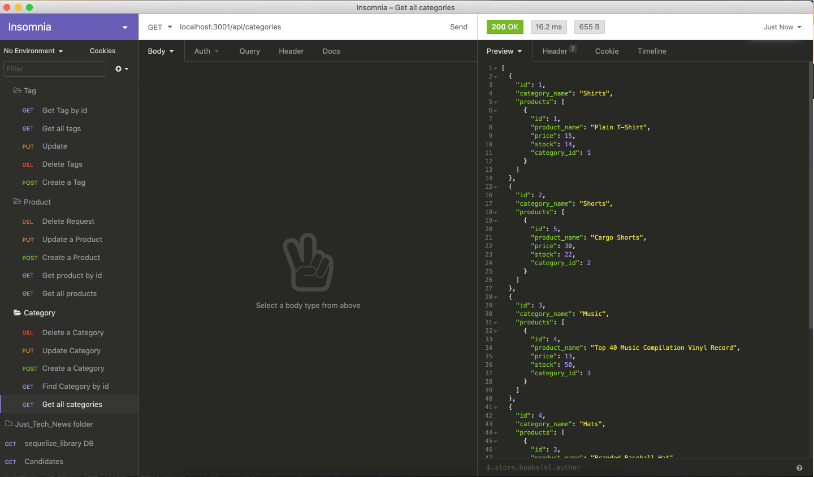
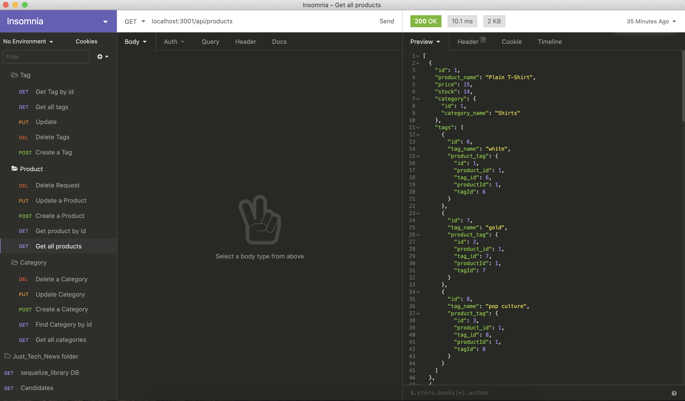
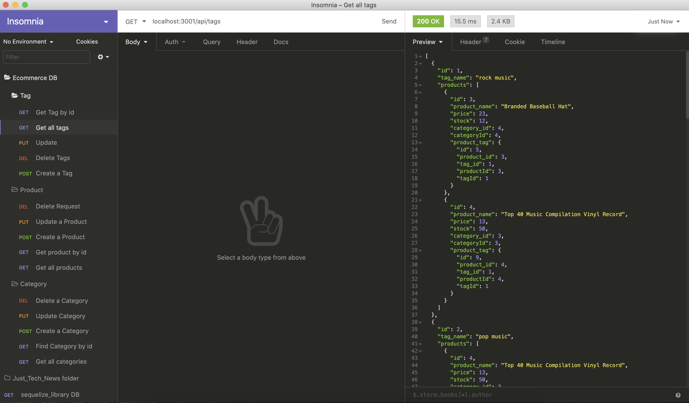

# Ecommerce

## Description
Backend of an Ecommerce retail store. The application uses node.js, sequelize, mysql, and javascript. 

## Table of Contents

* [Installation](#installation)
* [Usage](#usage)
* [Questions](#questions)
* [Links](#links)

## Installation
First you need to make sure you have node.js installed onto your local machine. Then make sure you have mysql installed on your computer, as well as the right username and password for your mysql database. After you clone the repository, run the command "npm install" all of the dependencies will be installed onto your project.  

## Usage
All you have to do is follow the steps provided up above. Then you will open up the terminal in the root directory of your project. Once you are in the terminal you will have to log into your mysql accout using the command "mysql -u {username} -p" (hit enter), then type in your password. When you are in the mysql terminal, go into the db folder, then the schema.sql file, copy the first line into the terminal and then do the same thing for the second line. This will drop/create the data-base that you need for the project. 
Then you will quit out of mysql, and go into the terminal and type "npm run seed". This will provide dummy data into the respective tables. 
When you have done all of that, the next thing that you will do is run "npm start", which will start the server, then you can use something like insomnia core to create, read, update and delete (CRUD) data. Using the seperate api endpoints /products, /categories, and /tags, you will go to localhost:3001/api/ and then you will be able to do the CRUD operations above, using the get, post, put, and delete request types.  

>

 

## Questions
If you have any questions you can visit my github profile at <https://github.com/>
or you can email me at <pschlafley0@gmail.com>

## Links
Here is a link to a video that demonstrates the project 
* [video demonstration]()  
* [Ecommerce github profile](https://github.com/pschlafley/Ecommerce)